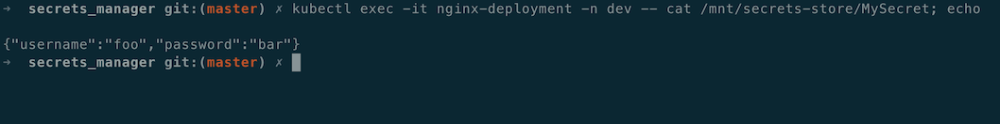

# Integrating Secrets Manager secrets with Kubernetes Secrets Store CSI Driver Notes

## References for Setup

* <https://github.com/kubernetes-sigs/secrets-store-csi-driver>
* <https://docs.aws.amazon.com/secretsmanager/latest/userguide/integrating_csi_driver.html>
* <https://github.com/aws/secrets-store-csi-driver-provider-aws>

## Prerequisites

- EKS Cluster
- kubectl installed
- eksctl installed
- AWS CLI v2 installed

## Install Secrets Store CSI Driver

```shell
# old method
# helm repo add secrets-store-csi-driver https://raw.githubusercontent.com/kubernetes-sigs/secrets-store-csi-driver/master/charts
# helm -n kube-system install csi-secrets-store secrets-store-csi-driver/secrets-store-csi-driver --set grpcSupportedProviders="aws"

# new method
helm repo remove secrets-store-csi-driver # location changed if you used in past...
helm repo add secrets-store-csi-driver https://kubernetes-sigs.github.io/secrets-store-csi-driver/charts
helm install csi-secrets-store secrets-store-csi-driver/secrets-store-csi-driver --namespace kube-system
kubectl --namespace=kube-system get pods -l "app=secrets-store-csi-driver"

kubectl apply -f https://raw.githubusercontent.com/aws/secrets-store-csi-driver-provider-aws/main/deployment/aws-provider-installer.yaml

kubectl get pods -n kube-system
```

## Sample Output

```text
csi-secrets-store-provider-aws-85nnj               1/1     Running   0          12s
csi-secrets-store-provider-aws-ckr5g               1/1     Running   0          12s
csi-secrets-store-provider-aws-knszf               1/1     Running   0          12s
csi-secrets-store-secrets-store-csi-driver-4wl9v   3/3     Running   0          82s
csi-secrets-store-secrets-store-csi-driver-bksmg   3/3     Running   0          82s
csi-secrets-store-secrets-store-csi-driver-cnjzx   3/3     Running   0          82s
```

## Create Sample Secret

```shell
export EKS_REGION="us-east-1"

aws --region ${EKS_REGION} secretsmanager create-secret --name MySecret --secret-string '{"username":"foo", "password":"bar"}'
```

## Setup IAM role for IRSA

```shell
aws iam create-policy \
    --policy-name SecretsManagerK8SPolicy \
    --policy-document file://SecretsManagerK8SPolicy.json

export AWS_ACCOUNT=$(aws sts get-caller-identity --output text --query 'Account')
# CHANGE ME!
export CLUSTER_NAME="<your_cluster_name>"
export NAMESPACE="<your_namespace>"

eksctl create iamserviceaccount \
    --name nginx-deployment-sa \
    --namespace ${NAMESPACE} \
    --region ${EKS_REGION} \
    --cluster ${CLUSTER_NAME} \
    --attach-policy-arn "arn:aws:iam::${AWS_ACCOUNT}:policy/SecretsManagerK8SPolicy" \
    --approve \
    --override-existing-serviceaccounts

eksctl get iamserviceaccount --cluster ${CLUSTER_NAME} --namespace ${NAMESPACE}
eksctl get iamserviceaccount nginx-deployment-sa --cluster ${CLUSTER_NAME} --namespace ${NAMESPACE}
```

## Deploy Test Pod

```shell
kubectl apply -f secret-provider-class.yaml -n ${NAMESPACE}
kubectl apply -f pod.yaml -n ${NAMESPACE}

kubectl describe pod nginx-deployment -n ${NAMESPACE}
```

## Test Access to Secret from Pod

```shell
kubectl exec -it nginx-deployment -n ${NAMESPACE} -- cat /mnt/secrets-store/MySecret; echo
```



---

<i>The contents of this repository represent my viewpoints and not of my past or current employers, including Amazon Web Services (AWS). All third-party libraries, modules, plugins, and SDKs are the property of their respective owners.</i>
